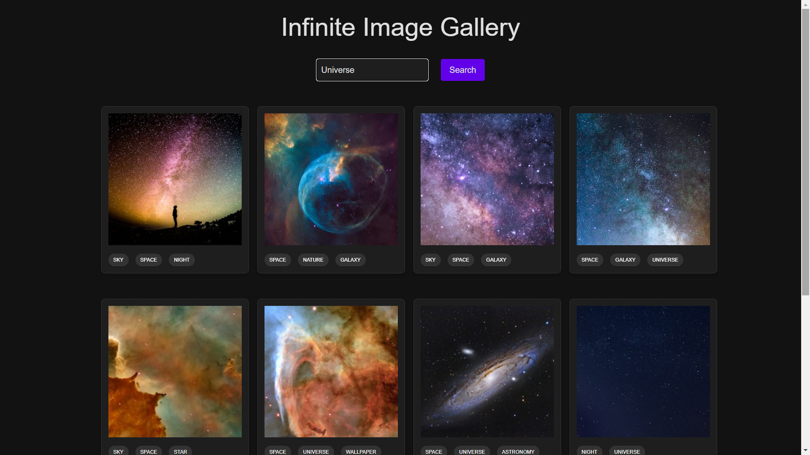
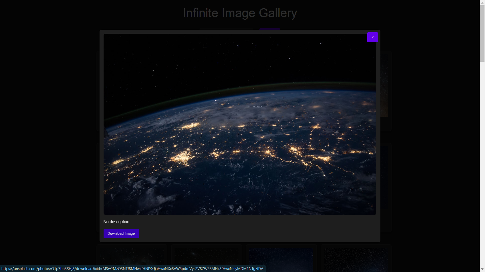

# Infinite Image Gallery

## Overview

The **Infinite Image Gallery** is an interactive React application
that allows users to search and explore high-quality images from
Unsplash. The app features infinite scrolling, a modal view for image
details, and a responsive design.

## Project Structure

The project is organized into the following key directories and files:

```arduino
infinite-scroll-gallery/
├── public/
│   ├── favicon.ico
│   ├── index.html
│   ├── logo192.png
│   ├── logo512.png
│   ├── manifest.json
│   └── robots.txt
├── src/
│   ├── assets/
│   │   ├── styles/
│   │   │   └── styles.scss
│   │   └── screenshots/
│   │       ├── home-page.png
│   │       └── image-modal.png
│   ├── components/
│   │   ├── ImageCard.tsx
│   │   ├── ImageModal.tsx
│   │   ├── SearchBar.tsx
│   │   └── ImageCard.css
│   ├── services/
│   │   └── unsplashService.ts
│   ├── utils/
│   │   └── infiniteScroll.ts
│   ├── types/
│   │   └── interfaces.ts
│   ├── App.css
│   ├── App.tsx
│   ├── index.css
│   ├── index.tsx
│   ├── react-responsive-masonry.d.ts
│   └── logo.svg
├── postcss.config.js
├── tailwind.config.js

```

## Technologies Used

- **React**: JavaScript library for building user interfaces. -
- **TypeScript**: Superset of JavaScript that adds static types. -
- **Axios**: HTTP client for making API requests. 
- **Tailwind** **CSS**: Utility-first CSS framework for styling. 
- **Unsplash API**: Provides high-quality images for the application. 
- **Custom Hooks**: For handling infinite scrolling and other reusable logic.

## Installation and Setup

### Install Dependencies

Using npm:

```bash 
npm install 
```

Or using yarn:

```bash 
yarn install 
```

### Set Up Environment Variables

Create a `.env` file in the root directory and add your Unsplash API
key. You can obtain your own API key by signing up at [Unsplash
Developers](https://unsplash.com/developers):

``` REACT_APP_UNSPLASH_ACCESS_KEY=your-unsplash-access-key ```

### Starting the App

#### Run the Development Server

Using npm:

```bash 
cd .\infinite-scroll-gallery\
npm start
```

Or using yarn:

```bash 
yarn start
```

This will start the development server and open the application in your
default web browser.

#### Build for Production

To build the application for production:

Using npm:

```bash 
npm run build
```

Or using yarn:

```bash 
yarn build 
```

The production build will be available in the `build` directory.

## Screenshots

 **Home Page**



 **Image Modal**



## Components

1. **`App`**

- The root component that manages state and renders child components. -
Handles image fetching, search queries, and selected image state.

2.  **`ImageCard`**

- Displays individual images in a card format. - Receives props for
image URL, alt text, and tags. - Triggers the modal on click.

3.  **`ImageModal`**

- Shows detailed information about the selected image. - Includes a
close button and a download link.

4.  **`SearchBar`**

- Allows users to input search queries and triggers image searches.

## Utilities

1. **`fetchImages`**

- Function to fetch images from Unsplash API based on search queries
and pagination.

2. **`useInfiniteScroll`**

- Custom hook for handling infinite scrolling behavior.

## TypeScript Interfaces

1. **`UnsplashImage`**

- Defines the structure of an image object returned by the Unsplash
API.

2. **`ImageCardProps`**

- Props for the `ImageCard` component.

3. **`ImageModalProps`**

- Props for the `ImageModal` component.

4. **`SearchBarProps`**

- Props for the `SearchBar` component.

5. **`FetchImagesResponse`**

- Structure of the response from the `fetchImages` function.

## Contributing

Contributions are welcome! Please follow these steps to contribute:

1. **Fork the Repository**

2. **Create a Feature Branch**

```bash 
git checkout -b feature/your-feature 
```

3. **Make Your Changes**

4. **Commit Your Changes**

```bash 
git commit -am 'Add your changes'
```

5. **Push to the Branch**

```bash 
git push origin feature/your-feature 
```

6. **Create a Pull Request**

Submit a pull request to merge your changes into the `main` branch.
